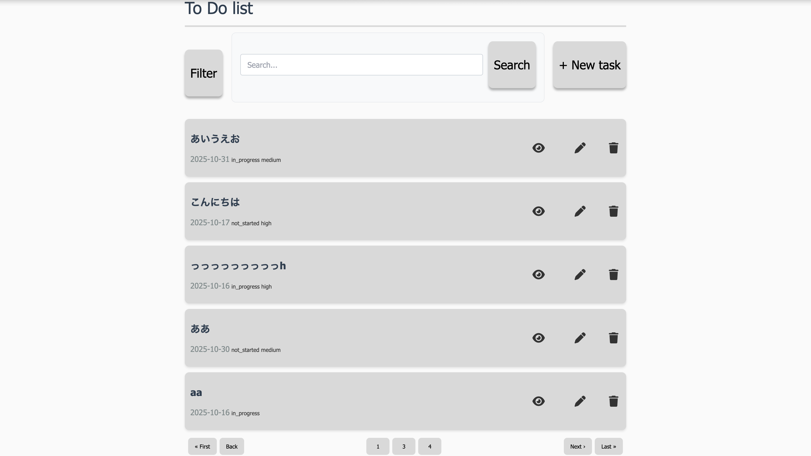
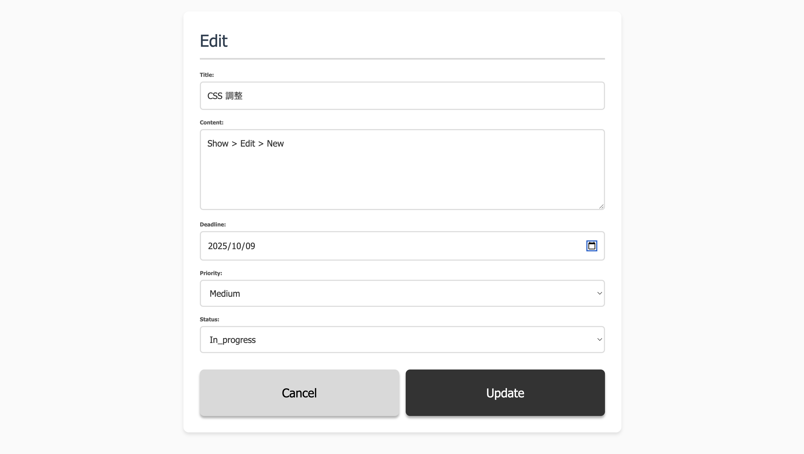
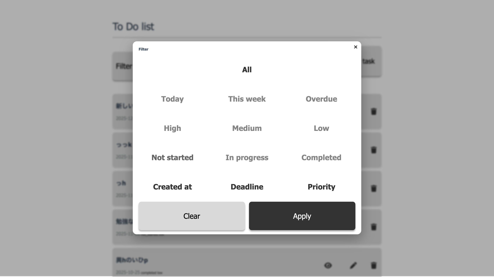

Task Manager App

Task management application created as a portfolio project.

Overview

A simple task management application designed to track daily tasks with filtering, sorting, and searching capabilities.

Tech Stack

Ruby 3.2.2

Rails 7.0.8

SQLite3

JavaScript (Stimulus)

Kaminari

Node.js / Yarn

Setup
Clone the repository
git clone <your-repo-url>
cd task-manager-app
bundle install
yarn install
rails db:create db:migrate
bin/dev
Features

Task CRUD

Search

Filter (period / priority / status / sorting)

Pagination (Kaminari)

Validation error messages

Responsive layout / Dark mode (system-based)

Screenshots
Index


List view with search bar, filter modal, and pagination.

Show


Task details with metadata, edit/delete actions.

Edit


Task update form with validation messages.

Filter


Modal UI for period / priority / status / sorting.

New


Task creation form with required-field validation.

Usage
Create a Task

New Task → enter title, content, deadline, priority, status → Create Task.

Edit a Task

Edit icon → modify fields → Update.

Delete a Task

Trash icon → confirm → delete.

Search

Enter a keyword → Search.
Clear button removes conditions.

Filter

Filter → select period / priority / status / sort → Apply.
Clear resets selections.

ER Diagram
```mermaid
erDiagram
  TASK {
    integer id
    string  title
    text    content
    date    deadline
    string  priority
    string  status
    timestamps
  }
```
Highlights (What I Focused On)
Consistent UI Designed from Figma Layouts

Established consistent spacing, typography, and layout based on an initial Figma design.

Search / Filter / Sort for Efficient Task Retrieval

Implemented multiple ways to find tasks quickly.

“All Mode” Filter Logic with Stimulus

Disabled irrelevant filter groups when “All” is selected to avoid conflicting states.

Immediate Validation Feedback

Required fields display clear error messages during creation and updates.

Challenges I Faced
Structuring UI and CSS Components

Maintaining consistent spacing and layout rules across pages required repeated adjustments.

Button Style Conflicts Caused by the Shared .btn Class

Action icons were unintentionally affected. Solved by separating styles.

Maintaining Filter/Search Conditions with Kaminari Pagination

Pagination originally reset filters. Fixed by preserving parameters.

Designing Filter Logic with Radio Buttons and Checkboxes

Implementing correct single/multiple selection behavior and “All mode” logic required careful testing.

License

MIT License.